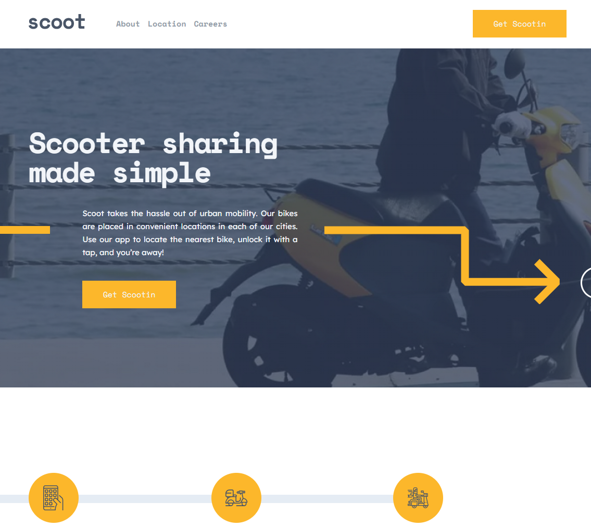

# Scoot project

For our Web dev training at BeCode, we had to reproduce a template of a multiple page design. We had to realise this challenge in duo.

## Table of contents

- [Scoot project](#scoot-project)
  - [Table of contents](#table-of-contents)
  - [Overview](#overview)
    - [The challenge](#the-challenge)
    - [Links](#links)
  - [Our process](#our-process)
    - [Built with](#built-with)
    - [Tools we used](#tools-we-used)
    - [Struggles](#struggles)
  - [What we learned](#what-we-learned)
  - [Authors](#authors)

## Overview



### The challenge

The challenge was to integrate the design received and divide the pages and part of the pages between the two of us. The pages should be responsive and hover states integrated. Furthermore, some JS Vanilla should be added to have interactive behaviours with the visitor (hamburger menu, display the menu when scrolling up). We also had to be particularly careful with the performance of the page and be sure to have a semantic correct HTML pages.

### Links

- [Solution](https://junior-dev-track.github.io/14-css-scoot-project-dan-jonathan/)

## Our process

### Built with

- Semantic HTML5 markup
- SCSS (variables, partials)
- Flexbox
- Grid
- Desktop-first workflow
- Git
- JS Vanilla

### Tools we used

- Lighthouse: to check the performance of the website
- W3C Validator: to make sure that our HTML is written correctly and follows the standards

### Struggles

As it was our first project in duo, the main challenge was to coordinate the project beforehand and to divide the project efficiently. The main difficulties we came accross were following:

- Use of Git by creating branches
- Coordinate for the design and understand each other how our partner works
- Understand what our partner is doing and avoid duplicate classes in CSS

## What we learned

1. The details/summary elements have been very helpful to integrate the FAQ without adding a JS layer to display the answer when the visitor click on the question.

```
<details class="faq__question">
	<summary><h4>How do I download the app?</h4></summary>
	<p>
	To download the Scoot app, you can search “Scoot” in both the App and Google Play stores. An even simpler way to do it would be to click the relevant link at the bottom of this page and you’ll be re-directed to the correct page.
	</p>
</details>
```

## Authors

- [Github - Daniel](https://github.com/Dany0409)
- [Github - Jonathan](https://github.com/crolette)
